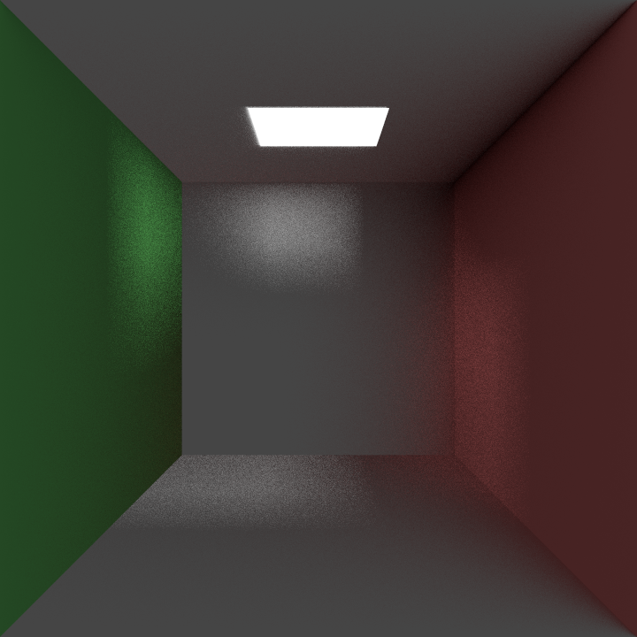

# Raybun

Raybun is a simple, distributed C-based raytracer. It renders 3D scenes defined in JSON files and supports distributed rendering across multiple machines (Master-Worker style).



## How it works

The core is a tile-based path tracer. It takes a JSON scene description (check out `data/scene_schema.json` for the format) which defines the camera, materials, and objects (spheres, quads, triangles, boxes, etc.).

A small scene example:

```json
{
  "config": {
    "width": 400, "height": 300, 
    "samples_per_pixel": 10, "max_depth": 5
  },
  "camera": {
    "position": [0, 0, -5], "look_at": [0, 0, 0], "up": [0, 1, 0],
    "fov": 60, "aspect_ratio": "4/3", "defocus_angle": 0, "focus_dist": 1
  },
  "materials": [
    { "type": "lambertian", "albedo": [0.8, 0.3, 0.3] },
    { "type": "metal", "albedo": [0.8, 0.8, 0.8], "fuzz": 0.1 }
  ],
  "objects": {
    "sphere": [{ "center": [0, 0, 0], "radius": 1, "material": 0 }],
    "models": [{ "file": "data/suzanne/model.obj", "material": 1, "position": [2, 0, 0], "scale": 1 }],
    "plane": [], "triangle": [], "quad": [], "boxes": []
  }
}
```

### Distributed Rendering (UNDER WORK)
It uses a **Master-Worker** architecture over HTTP/JSON:

1.  **Master** starts up, loads the scene, and listens on a port.
2.  **Workers** connect to the master.
3.  First thing a worker does is run a quick **benchmark** to calculate a performance score.
4.  Workers send their machine info (thread count, perf score) to the Master.
5.  Master breaks the image into tiles and hands them out. Workers render tiles and POST the pixels back.

It uses `libmicrohttpd` for the server and `libcurl` for the client.

## Building & Running

You'll need `libcurl` installed.

```bash

make

# Run benchmark:
./build/raybun benchmark

# Run standalone:
./build/raybun standalone data/simple_scene.json output.jpg

# Run a master node:
./build/raybun master 3000 data/simple_scene.json output.ppm

# Run worker node(s):
./build/raybun worker http://localhost:3000 worker1_name

```

## Example showing work sharing

`./build/raybun master 3000 data/simple_scene.json 
    & sleep 0.5 && ./build/raybun worker http://localhost:3000 worker1`
Output: 
```bash
[raybun] 461245
[INFO] Benchmark results for 76931fac-dab2-36c2-8b87-6ae33f9a62d7: Rendered data/benchmark.json in 3419ms, Performance Score: 7.31/10, Thread Count: 8, SIMD type -1.
[INFO] load_scene: Loaded data/suzanne/model.obj with 511 vertices and 0 triangles
[INFO] load_scene: Loaded scene in 1.705000ms
[INFO] load_scene: Creating image of size 720 x 720
[INFO] load_scene: Loaded 0 spheres
[INFO] load_scene: Loaded 0 planes
[INFO] load_scene: Loaded 0 triangles
[INFO] load_scene: Loaded 6 quads
[INFO] load_scene: Loaded 10 materials
[INFO] Breaking into 144 tiles
[INFO] Master: Starting server on port 3000
[INFO] master_start_server: Started master server
[INFO] render_scene_distributed: Starting with 7 threads
[INFO] Benchmark results for worker1: Rendered data/benchmark.json in 4325ms, Performance Score: 6.31/10, Thread Count: 8, SIMD type -1.
[INFO] Worker: Connecting to Master at http://localhost:3000:0
[INFO] Master: Serving scene 234845181 to worker
[INFO] Master: Registering worker 'worker1' (Perf: 6.31)
[INFO] Master: Worker 'worker1' mapped to index 0 in MasterState
[INFO] Master: Assigned tile 40 (256,192 64x64) to 'worker1' (idx 0)
[INFO] load_scene: Loaded data/suzanne/model.obj with 511 vertices and 0 triangles
[INFO] load_scene: Loaded scene in 1.606000ms
[INFO] Worker: Registered with master
[INFO] Master: Received result for tile 40 from 'worker' (external), assigned idx was 0
[INFO] Master: Assigned tile 45 (576,192 64x64) to 'worker1' (idx 0)
[INFO] Master: Received result for tile 45 from 'worker' (external), assigned idx was 0
[INFO] Master: Assigned tile 51 (192,256 64x64) to 'worker1' (idx 0)
[INFO] Master: Received result for tile 51 from 'worker' (external), assigned idx was 0
[INFO] Master: Assigned tile 56 (512,256 64x64) to 'worker1' (idx 0)
[INFO] Master: Received result for tile 56 from 'worker' (external), assigned idx was 0
[INFO] Master: Assigned tile 65 (320,320 64x64) to 'worker1' (idx 0)
[INFO] Master: Received result for tile 65 from 'worker' (external), assigned idx was 0
[INFO] Master: Assigned tile 69 (576,320 64x64) to 'worker1' (idx 0)
[INFO] Master: Received result for tile 69 from 'worker' (external), assigned idx was 0
[INFO] Master: Assigned tile 76 (256,384 64x64) to 'worker1' (idx 0)
[INFO] Master: Received result for tile 76 from 'worker' (external), assigned idx was 0
[INFO] Master: Assigned tile 79 (448,384 64x64) to 'worker1' (idx 0)
[INFO] Master: Received result for tile 79 from 'worker' (external), assigned idx was 0
[INFO] Master: Assigned tile 88 (256,448 64x64) to 'worker1' (idx 0)
[INFO] Master: Received result for tile 88 from 'worker' (external), assigned idx was 0
[INFO] Master: Assigned tile 93 (576,448 64x64) to 'worker1' (idx 0)
[INFO] Master: Received result for tile 93 from 'worker' (external), assigned idx was 0
[INFO] Master: Assigned tile 96 (0,512 64x64) to 'worker1' (idx 0)
[INFO] Master: Received result for tile 96 from 'worker' (external), assigned idx was 0
[INFO] Master: Assigned tile 102 (384,512 64x64) to 'worker1' (idx 0)
[INFO] Master: Received result for tile 102 from 'worker' (external), assigned idx was 0
[INFO] Master: Assigned tile 111 (192,576 64x64) to 'worker1' (idx 0)
[INFO] Master: Received result for tile 111 from 'worker' (external), assigned idx was 0
[INFO] Master: Assigned tile 118 (640,576 64x64) to 'worker1' (idx 0)
[INFO] Master: Received result for tile 118 from 'worker' (external), assigned idx was 0
[INFO] Master: Assigned tile 122 (128,640 64x64) to 'worker1' (idx 0)
[INFO] Master: Received result for tile 122 from 'worker' (external), assigned idx was 0
[INFO] Master: Assigned tile 127 (448,640 64x64) to 'worker1' (idx 0)
[INFO] Master: Received result for tile 127 from 'worker' (external), assigned idx was 0
[INFO] Master: Assigned tile 133 (64,704 64x16) to 'worker1' (idx 0)
[INFO] Master: Received result for tile 133 from 'worker' (external), assigned idx was 0
[INFO] Master: Assigned tile 134 (128,704 64x16) to 'worker1' (idx 0)
[INFO] Master: Received result for tile 134 from 'worker' (external), assigned idx was 0
[INFO] Master: Assigned tile 139 (448,704 64x16) to 'worker1' (idx 0)
[INFO] Master: Received result for tile 139 from 'worker' (external), assigned idx was 0
[INFO] Master: Worker 'worker1' requested work but no tiles left
[INFO] render_scene_distributed: Completed in 4386ms
[INFO] Master: master-side rendering done; waiting for 144 tiles total
[INFO] Master: all tiles completed (master+workers)
[INFO] worker_connect: Connected to master
[INFO] Press Enter to exit...
[INFO] export_image: Successfully written data/simple_scene.png
[INFO] Press Enter to exit...
```

## TODO
- Share work based on perf score
- reassign tile(s) to other worker if original worker timed-out
- reassign tile(s) if all workers timed-out
- reassign tile(s) if faster worker registered?
- Switch to binary image transfer?
- SIMD?
